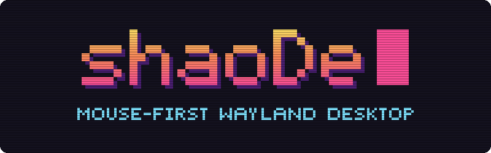

<h1 align="center"></h1>

A mouse-first Wayland desktop with Lua configuration, floating windows,
edge snapping, and optional Hyprland-style automatic tiling. C++ owns configuration and desktop policy;
a C adapter integrates wlroots. A Qt Quick shell adds a desktop, taskbar, and
searchable application launcher.

This is an early development project, not a replacement desktop session yet.

## Build and run

The first working compositor supports real Wayland applications, focus follows mouse,
mouse move/resize, configurable shortcuts, half-screen snapping, maximize/restore,
a one-shot grid arrangement, automatic dwindle tiling that can be switched on and
off per monitor, workspaces, and Lua reload. It uses a TinyWL-derived C adapter
with C++ configuration and placement policy. The Qt shell runs live
through LayerShellQt, with a panel and desktop on every monitor.

Requirements: CMake 3.25+, C11 and C++20 compilers, pkg-config, Lua 5.4,
xkbcommon, wlroots **0.20.x**, wayland-server, wayland-protocols, and
wayland-scanner. The shell also needs Qt 6.5+ (Core, Gui, Network, Qml, Quick, Quick Controls
Basic, Quick Layouts, and the Wayland platform plugin), LayerShellQt 6.6+, GLib/GIO,
and wayland-client. Tests use Python 3. Ninja is used below.
Gentoo setup and standalone-session instructions are in [docs/gentoo.md](docs/gentoo.md).
The build supports a normal install prefix and DESTDIR staging.

```sh
cmake -S . -B build -G Ninja -DSHAODE_BUILD_COMPOSITOR=ON
cmake --build build
ctest --test-dir build --output-on-failure
./build/shaode --config config/init.lua --check-config
./build/shaode --config config/init.lua --exec kitty
```

The compositor opens a nested window in the current Wayland session.
It selects only the Wayland backend; `--headless` selects the headless backend
for testing. The separate `--session` option selects DRM/libinput from a TTY; that physical
backend is experimental: it has run on an AMD laptop (one built-in screen) and an
NVIDIA desktop with three monitors; hotplug and suspend are untested. Session-file
installation is opt-in with `SHAODE_INSTALL_SESSION=ON`.
Applications launched through `--exec`, startup entries, or bindings inherit
the nested Wayland socket. Commands after `--exec` consume all remaining
arguments; there is no shell expansion. Full builds start the desktop shell
automatically; `--no-shell` or Lua `shell.enabled = false` disables it. Headless
mode never starts the shell automatically. No other applications start
automatically with the example configuration.

The shell has pinned desktop shortcuts (double-click to launch), a taskbar with
window activation/minimization and a right-click window menu (maximize/restore,
minimize, pin to taskbar, close), middle-click to close a window, a right-click menu on empty bar space (tiling,
applications, show desktop), an application
search menu, a tiling on/off button for its monitor, a clock, and a show-desktop button. Installed applications are read
from desktop entries through GIO. Lua configures the panel's height, top or
bottom placement (`panel_position`), margins that make it float (`panel_margin`, one
number or `{ top, right, bottom, left }`), corner radius, font and text size, colors
(`#RRGGBB`, or `#RRGGBBAA` for a translucent panel), wallpaper, and pinned commands. Pinned commands run from your home directory. Installed applications can also be
pinned to the taskbar from a window's menu or the application menu, and unpinned
by right-clicking their button; those pins are kept in
`$XDG_STATE_HOME/shaode/pinned` (`~/.local/state/shaode/pinned`), one desktop id per
line, and stay off the desktop. An application's windows share one taskbar button, stacked
with a count when there are several: clicking it cycles through them, and hovering lists them
to pick or close one. `group_windows = false` gives every window its own button. In a nested
session, applications that reuse an existing process or D-Bus service can open
in the host session instead.

Default bindings (edit [config/init.lua](config/init.lua)):

| Input | Action |
| --- | --- |
| Super + left/right drag | Move / resize a window (on a tile: move it, or move its splits) |
| Super + Q | Launch Kitty |
| Super + R | Open or close the application menu on the monitor under the pointer |
| Super + C | Close focused window |
| Super + M | Exit shaoDe |
| Super + V | Float or tile the focused window |
| Super + F | Toggle fullscreen |
| Super + T | Arrange the current output's windows in a grid (floating mode) |
| Super + S | Turn automatic tiling on or off for the focused monitor |
| Super + P | Make the focused window sticky (shown on every workspace of its monitor), or not |
| Alt + Tab / Alt + Shift + Tab | Window switcher over every window on every monitor and workspace, shown on the focused monitor (see [Window switcher](#window-switcher)) |
| Super + Left/Right/Up/Down | Focus the nearest window in that direction |
| Super + Shift + arrows | Move the window that way, as Hyprland's `movewindow`: a tile trades places with its neighbour, a floating window goes to that edge; past the edge, on to the next monitor |
| Super + Ctrl + Shift + arrows | Resize the window by 40 pixels: a tile's split moves that way, a floating window's right or bottom edge moves that way (see [Tiling](#tiling)) |
| Super + 1–4 | Switch to workspace 1–4 |
| Super + Shift + 1–4 | Move the focused window to workspace 1–4 |
| Super + Ctrl + Left/Right | Previous / next workspace |
| Super + Tab | Back to the workspace the monitor showed before |
| Super + Shift + minus | Hide the focused window in the scratchpad |
| Super + minus | Show a scratchpad window, hide it again, or show the next one |
| Super + Shift + R | Reload Lua configuration |
| Print | Screenshot of a region you select |
| Shift + Print | Screenshot of the monitor under the pointer |
| Super + Print | Screenshot of the focused window |

### Window switcher

Alt + Tab (`switcher`) opens the window switcher in the middle of the focused monitor. It
lists every window, on every monitor and workspace and including minimized ones, most
recently focused first, with the window focused before the current one selected. Keep Alt
held and press Tab to move on (Shift + Tab, `switcher_prev`, or the arrow keys, to move
back); releasing Alt focuses the selected window, switching its monitor to its workspace and
restoring it if minimized. Return picks at once, Escape cancels, and clicking a window picks
it. While the switcher is open, keys do not reach applications. The compositor keeps the
switcher and the shell draws it, only once it has been open for a moment, so a quick
Alt + Tab flips between two windows without it flashing up; without the shell it still
switches, unseen. Bound to a key without modifiers, or sent as
`shaode msg switcher`, it stays open until `switcher_confirm [N]` (the Nth window in the
list), `switcher_cancel`, Return, or Escape. `cycle` is the older action that raises the
least recently focused window on the spot.

The host compositor can consume shortcuts before the nested compositor receives
them: a host that grabs Super (Hyprland, GNOME) keeps these, so set `mod = "Alt"` in
the Lua file for nested sessions. SIGHUP also requests a reload, and
SIGINT/SIGTERM requests shutdown. A reload does not rerun startup commands.

Windows that leave decorations to the window manager (Wayland applications that support
server-side decorations, such as kitty, and X11 applications such as Spotify) get no title
bar. Instead, a strip of three flat buttons sits over their top-right corner (minimize,
fullscreen, and close, from left to right) and appears when the pointer nears that corner, so
it never covers text. Dragging the window's top edge (its top 6 pixels, as a title bar would)
moves the window. Other windows, and windows that ask to draw their own frame, decorate
themselves.

Dropping a dragged window with the pointer at the top edge of the screen, or on a panel along
it, maximizes it below the panels; dragging it away again restores its earlier size. Hovering a
window focuses it without raising it (`mouse.focus_follows = false` turns this off), except
while dragging, while a menu or popup is open, or while a panel or launcher has the keyboard.

The panel and other bars stay hidden on a monitor showing a fullscreen window, even after
another window takes focus, until the window leaves fullscreen or its workspace is switched
away; the panel still shows while its launcher or a menu is open.

Limitations: snapping is keyboard-driven, without edge-drag previews. Window
placement during interactive resize is immediate, without waiting for the
client's next buffer.

## Tiling

Tiling is a setting of each monitor. The tiling button on a monitor's panel (next to the
clock) switches that monitor between floating windows and automatic tiling; Super + S
or `shaode msg toggle_tiling` switches the focused monitor, and
`shaode msg output HDMI-A-1 toggle_tiling` a named one. Lua `layout.tiling = true` starts
every monitor tiled, and `tiling` in a monitor's `outputs.monitors` entry overrides it:

```lua
layout = { tiling = false },
outputs = { monitors = { ["DP-3"] = { tiling = true } } }, -- only DP-3 tiles
```

A monitor keeps its toggled state across reloads, and across being unplugged, until its
configured setting changes; a reload then applies the new setting. Tiling follows Hyprland's default *dwindle*
layout: every output and workspace has its own binary split tree, each split divides
its space along the longer side, and a new window opens on the output under the
pointer, splitting the focused window there (or the one under the pointer) on the side
nearer the pointer. Floating windows also open on the pointer's output. Closing a window gives its
space back to its neighbour.

- Mod + right drag on a tile, or dragging its edge, moves the split lines around it.
- Moving a tile (Mod + left drag or its title bar) lifts it out; dropping it splits
  the tile under the pointer. A window dropped on another monitor that tiles joins the
  tiling there even if snapping or maximizing, or its old monitor not tiling, had floated
  it; one floated with Super + V stays floating. A tile dropped on a monitor that does not
  tile floats there.
- Dialogs and fixed-size windows float. Super + V (`toggle_floating`) floats
  or tiles the focused window; snapping or maximizing a tile also floats it.
- Turning tiling off returns every window of that monitor to its floating position and
  size. A window
  now tiled on another monitor keeps its size and its place relative to that monitor,
  shrunk and moved to fit inside it.
- Minimized windows leave the tiling and rejoin it when restored; windows moved to
  another workspace join that workspace's tiling on the same output.
- Super + arrows focus the neighbouring tile that way, or the next monitor that way when
  there is none, even an empty one, where new windows then open; Super + Shift + arrows swap
  the focused tile with it (`focus_left` … `focus_down`, `move_left` … `move_down`). With
  `focus_follows` on, these and Alt+Tab put the pointer just inside the window's bottom-right
  corner, out of the way.
- Super + Ctrl + Shift + arrows (`resize_left` … `resize_down`) resize from the keyboard, by
  40 pixels or the binding's `amount` (`shaode msg resize_right 80`). On a tile the arrow
  moves a split beside it that way: the one on that side of the tile if there is one, growing
  it, else the one on its other side, shrinking it. With two tiles side by side, Right always
  moves the line between them right. A tile in the middle of three columns only grows this
  way; shrink it by resizing a neighbour. Splits stop at 10% and 90% of their space, as with
  the mouse. A floating (or sticky) window moves its right or bottom edge that way, growing no
  further than its monitor's edge and shrinking no smaller than 64 pixels; a snapped window
  leaves its snapped place at its current size. Maximized and fullscreen windows do not
  change. Holding the keys keeps resizing, at the keyboard's `repeat_delay` and
  `repeat_rate`. `features = { keyboard_resize = false }` turns the actions off.

Not yet: per-workspace on/off, and keeping floating windows above tiles. Windows tiled on a
monitor that is unplugged keep their place until it returns; a monitor disabled in the config
hands its tiles to the nearest one, where they float if that one does not tile.

Pointer devices in a standalone `--session` take `mouse.speed` (-1 to 1),
`mouse.acceleration` (`"flat"` or `"adaptive"`), and `mouse.natural_scroll`; touchpads also
take `touchpad.natural_scroll`, `tap_to_click`, and `disable_while_typing`. Unset settings
keep each device's defaults, and a reload applies changes. Nested sessions get their pointer
from the host, so these do nothing there.

`layout.gap` sets the space around tiles; `gap_inner` (between windows) and `gap_outer`
(at the output's edges) set them separately. Hyprland's `gaps_in` is half of `gap_inner`,
since Hyprland adds it on both sides. The `windows` table draws a border around each window
(`border_width`, `border_color` for the focused one, `border_inactive_color`) and sets
`opacity` and `inactive_opacity`, per application too with `rules`. Fullscreen windows have no
border and stay opaque. Rounded corners, blur, and shadows need a renderer that wlroots' scene
graph does not provide.

Each entry of `windows.rules` matches windows by `app_id`, `title`, or both, each a regular
expression searched in the window's app ID or title (X11 windows match their `WM_CLASS` class
as `app_id`). A window takes its `opacity` and `inactive_opacity` from the first matching rule
that sets either. Rules can also act on a window once, as it opens (like sway's `for_window`
and `assign`):

```lua
windows = {
    rules = {
        { app_id = "^org.pulseaudio.pavucontrol$", floating = true, size = { 800, 500 },
          position = "center" },
        { app_id = "^thunderbird$", workspace = 2, focus = false },
        { title = "^Picture-in-Picture$", floating = true, size = { 480, 270 },
          position = { 1400, 40 }, focus = false },
        { app_id = "^mpv$", output = "HDMI-A-1", fullscreen = true },
    },
},
```

| Action | Effect |
| --- | --- |
| `floating = true` / `false` | Keeps the window out of the tiling, or tiles it even if it is a dialog. |
| `workspace = N` | Opens it on workspace N of its monitor, without switching there or focusing it. |
| `output = "NAME"` | Opens it on that monitor: a connector name, or `"desc:"` and the start of its "make model serial", as in `outputs.monitors`. A monitor that is not connected is ignored. |
| `size = { w, h }` | Its floating size (also `{ width = w, height = h }`), at most the usable area. |
| `position = "center"` or `{ x, y }` | Its floating place, centred or from the top-left of the monitor's usable area (panels excluded; also `{ x = x, y = y }`). |
| `fullscreen = true` | Opens it fullscreen. |
| `maximize = true` | Opens it maximized, floating over the tiles. |
| `focus = false` | Leaves the focus where it was. A fullscreen window on the current workspace still takes it. |
| `sticky = true` | Opens it sticky (see below) on its monitor's current workspace, whatever `workspace` says. Ignored with `features = { sticky = false }`. |

Every matching rule applies, in order; where two set the same action, the later one wins. A
tiled window keeps `size` and `position` as the place it floats to when toggled. Rules see the
app ID and title the window has when it opens; later title changes do not apply them again.
`features = { window_rules = false }` turns the actions off and leaves opacity rules working.

Windows fade in while growing slightly when they open, and fade out while shrinking slightly
when they close (drawn from a copy of their last frame). Tiles glide to their new place when
the layout changes; their new size shows as soon as the application draws it. The scene graph
has no transform for a whole window, so the scaling resizes each of its surfaces about the
window's center. `animations = { enabled = false }` turns this off, and `duration` sets the
length in milliseconds (default 120, 10–1000). Window positions reported by `shaode msg` are
always the final ones.

Every monitor has its own workspaces, numbered 1 to `layout.workspaces` (1–10), and all
start on 1. Workspace shortcuts switch the focused monitor: the one whose window was
focused, whose workspace was switched, or that was clicked last. A monitor's bare desktop
counts as a window there: pointing at it (with focus following the mouse) or clicking it
focuses that monitor, and the window on the other monitor loses the keyboard, so Super + minus
or Super + R then act on the empty monitor. A window belongs to the
monitor it is on; moved to another monitor, it joins the workspace showing there. The
panel on each monitor shows that monitor's workspaces, marking the current one and those
with windows; scrolling over it pages through them and clicking a number switches to it.
The taskbar lists windows from every workspace, and activating one switches its monitor
to its workspace. Window shortcuts act only on visible windows.

Each monitor also remembers the workspace it showed before, however it was switched, and
the `workspace_back` action (Super + Tab) returns to it, like sway's
`workspace back_and_forth`. With `features = { workspace_back_and_forth = true }`, as sway's
`workspace_auto_back_and_forth`, a `workspace N` action for the workspace already shown
does the same, so pressing Super + 2 twice flips between workspace 2 and the one before.
It is off by default.

The scratchpad works as in sway. `move_to_scratchpad` (Super + Shift + minus) floats the
focused window and hides it. `scratchpad_show` (Super + minus) hides the focused scratchpad
window again; otherwise it focuses a scratchpad window already shown on the focused monitor, or
brings the one hidden longest to the middle of that monitor's current workspace, so repeated
presses cycle through them. A shown scratchpad window stays in the scratchpad until it is moved
to a workspace or tiled (Super + V). Hidden windows stay in the taskbar as minimized windows,
so the mouse can still find them; activating one there shows it as `scratchpad_show` would.
`features = { scratchpad = false }` turns both actions off, and a reload then brings hidden
windows back to the current workspace.

A sticky window, as with sway's `sticky enable`, shows on every workspace of its monitor:
`toggle_sticky` (Super + P, `shaode msg toggle_sticky`, or a mouse button binding for the
window under the pointer) floats it, and switching that monitor's workspace keeps it shown
and raises it over the workspace's windows. Moved to another monitor, it stays sticky there;
`move_to_workspace` unsticks it and moves it. Unsticking a window that was a tile tiles it
again on the current workspace (Super + V does the same). The taskbar keeps listing it, and
activating it does not switch workspaces. `features = { sticky = false }` turns the action
off, and a reload that sets it returns sticky windows to their monitor's current workspace.

Portals run as D-Bus services, started with the bus's environment rather than the
compositor's. A standalone `--session` therefore exports `WAYLAND_DISPLAY`, `DISPLAY`,
`XDG_CURRENT_DESKTOP=shaoDe`, `XDG_SESSION_TYPE`, and `SHAODE_SOCKET` with
`dbus-update-activation-environment --systemd` before it starts anything; the nested mode
leaves the host's portals alone, so its applications share and pick files through the host.
The installed `shaode-portals.conf` selects `xdg-desktop-portal-wlr` for screen sharing and
screenshots and `xdg-desktop-portal-gtk` for everything else. Install both, plus PipeWire
and `slurp` (the wlr portal's monitor picker on multi-monitor setups). An
`xdg-desktop-portal` that is already running keeps the desktop it started with; after
leaving another desktop, run `systemctl --user restart xdg-desktop-portal` once or log out
fully. The session also sets `MOZ_ENABLE_WAYLAND=1`, `ELECTRON_OZONE_PLATFORM_HINT=auto`,
and `_JAVA_AWT_WM_NONREPARENTING=1` unless they are already set.

Monitors sit side by side, top-aligned. `outputs.order` lists connector names
(such as `DP-3`) left to right; unlisted monitors follow on the right in the order
they appear. The cursor starts on `outputs.primary`, else on the leftmost monitor. By default each monitor runs its preferred resolution at the fastest
refresh rate available for it. `outputs.monitors`, keyed by connector name, overrides
that per monitor:

```lua
outputs = {
    primary = "DP-3",
    monitors = {
        ["DP-3"] = { mode = "2560x1440@200", scale = 1.25, position = { x = 0, y = 0 } },
        ["HDMI-A-1"] = { mode = "2560x1440@144", position = { x = -2048, y = 0 } },
        ["DP-1"] = { enabled = false },
    },
},
```

`mode` is `WIDTHxHEIGHT` or `WIDTHxHEIGHT@HZ`; the closest refresh rate at that
resolution wins. `scale` is fractional, `transform` takes Hyprland's (and Wayland's)
0–7, `enabled = false` turns a monitor off (never the last one), `vrr = true` enables
adaptive sync where the monitor supports it, and `tiling` overrides `layout.tiling` (see
[Tiling](#tiling)). A key such as `["desc:ASUSTek COMPUTER INC
VG27AQ3A"]` matches the start of a monitor's "make model serial" (listed by `shaode msg get
outputs`), as Hyprland's `desc:` does; a connector-name key wins over it. Monitors with a
`position` go there, in logical pixels after scaling; the rest follow in a row to their
right. The whole layout then shifts so its top-left corner is 0, 0, because X11 apps
get no input at negative coordinates; windows move with their monitor. `shaode msg get
outputs` prints what each monitor ended up with. Reloading
applies changes without restarting.

`shaode import ~/.config` carries an existing Hyprland/Waybar setup over: monitors, colors
(wallbash or pywal), bar look, gaps, borders, opacity, input, animations on/off, and
wallpaper. It runs
`hyprland.lua` in a sandbox (or parses `hyprland.conf`), writes `theme.lua` beside the
configuration, and reports where each value came from and what it skipped. `init.lua` loads
it with `theme = "theme.lua"` and overrides any of it; `--dry-run` only prints. See
[docs/dotfile-import.md](docs/dotfile-import.md) for the details and for the settings shaoDe
still lacks (rounding, blur, shadows).

A control socket runs any Lua action from scripts or other tools:
`shaode msg workspace 2`, `shaode msg toggle_tiling`, `shaode msg spawn foot`,
`shaode msg screenshot window`, `shaode msg resize_left 80`. Prefixing
`output NAME` makes workspace and tiling actions switch that monitor instead of the focused
one: `shaode msg output HDMI-A-1 workspace_next`. The query
`shaode msg get workspace` prints the focused monitor's workspace, `shaode msg get workspaces`
prints one tab-separated line per monitor (name, current workspace, focused, the
workspaces holding windows, such as `1,3`, or `-`, and tiling, `on` or `off`),
`shaode msg get tiling` prints `on` or `off` for the focused monitor, `shaode msg get outputs` prints one tab-separated line per monitor (name,
enabled, x, y, logical width and height, scale, transform, mode, and "make model serial"), and
`shaode msg get windows` prints one tab-separated line per window:
workspace, focused, minimized, tiled, x, y, width, height, app ID, title, monitor,
visible, scratchpad (a window hidden there is also minimized), and sticky. `shaode msg get layers` prints one line per panel or other layer-shell surface:
namespace, output, layer (0 background to 3 overlay), and whether it is shown.
`shaode msg get animations` prints the number of running animations and of window trees in
the scene (closing windows count until their animation ends), mainly for tests. A client
that sends `subscribe` keeps its connection and receives `tiling on|off` and
`workspace N` (the focused monitor's), and one `output NAME N USED TILING` line per monitor
(as in `get workspaces`) after every change, plus `launcher OUTPUT` when the `launcher` action
(Super + R) asks the panel on that monitor to open or close its application menu; the panel uses this. The window switcher sends `switcher OUTPUT SELECTED COUNT` followed by
COUNT lines `switcher-window APP_ID TITLE OUTPUT WORKSPACE MINIMIZED` (tab-separated) when it
opens or a listed window closes, `switcher-select N` as the selection moves (both counting
from 0), and `switcher-close`. Children of the session find the socket through `SHAODE_SOCKET`. Actions are
refused while the session is locked.

Screen locking uses the standard `ext-session-lock-v1` protocol, so lockers such
as swaylock or gtklock work; bind one with a `spawn` action. The desktop is covered
before the locker draws, only the locker receives input, and if it crashes the
session stays locked until a new locker takes over. Idle notification and idle
inhibition (`ext-idle-notify-v1`, `idle-inhibit-unstable-v1`) let swayidle lock
or blank after inactivity while video players keep the session awake. While a standalone
session is on screen it holds a logind sleep inhibitor, so an idle daemon left running by
another desktop on a different VT cannot suspend the machine; switching VTs away releases it.
This needs sd-bus from libsystemd, libelogind, or basu at build time.

Browsers and Electron applications (Firefox, Chromium, Discord) get the protocols they
look for: GPU buffers through linux-dmabuf with explicit sync where the driver supports it,
viewporter, fractional scaling, presentation timing, xdg-output, middle-click paste
(primary selection), clipboard managers (`wl-clipboard`, data-control), drag-and-drop,
pointer lock and relative motion for games, and xdg-foreign for portal dialogs.
xdg-activation lets an application raise itself, so a link clicked in a chat brings the
browser forward; shaoDe honours every valid token and does not prevent focus stealing.
Popup menus are kept on the output of their window.

Firefox and GTK applications draw their own minimize, maximize, and close buttons, laid
out by GTK's `button-layout` setting, which desktops without title bar buttons (HyDE on
Hyprland, for one) leave empty. shaoDe gives the applications it starts a dconf profile
(`DCONF_PROFILE`) that locks that one setting to `windows.buttons`, by default
`"appmenu:minimize,maximize,close"`; `""` keeps the desktop's value. Every other GTK
setting still comes from, and is saved to, your own dconf database, so other sessions
see no change. This needs `dconf` at startup.

The `screenshot` action (Print, or `shaode msg screenshot region|output|window`) runs
[`grim`](https://sr.ht/~emersion/grim/), with [`slurp`](https://github.com/emersion/slurp)
to select a region, and saves `Screenshot_<date>_<time>.png` in `$XDG_PICTURES_DIR/Screenshots`
(from the environment or `user-dirs.dirs`), else `~/Pictures/Screenshots`. The `output` mode
captures the monitor under the pointer and `window` the focused window's area as it appears on
screen, including anything overlapping it. It also copies the image to the clipboard with
`wl-copy` and announces the file with `notify-send`, when they are installed. Lua
`screenshots = { directory = "~/Shots", clipboard = false, notify = false }` changes that; in a
binding, `mode = "output"` picks the mode (default `region`). Without grim (or slurp for a
region), `shaode msg screenshot` fails with a message and a key binding logs one.

Screenshots and screen sharing use wlr-screencopy, export-dmabuf, and
ext-image-copy-capture, so `grim` works directly and Discord, OBS, or a browser share a
monitor or a single window through xdg-desktop-portal-wlr. A shared window is drawn on
its own, without whatever overlaps it, and keeps streaming while minimized or on another
workspace.

X11 applications run through XWayland when wlroots is built with X support and
`Xwayland` is installed. `DISPLAY` is set from the start, but Xwayland only
starts when the first X11 client connects and exits again once idle (Lua
`xwayland = false` disables it; changing it needs a restart). X11 windows take
part in focus, the taskbar, snapping, maximize, and fullscreen like Wayland windows.

wlroots' X11 window manager can leave events unprocessed, which loses the
first window after Xwayland starts. Until wlroots fixes this, shaoDe nudges the
window manager every 250 ms while Xwayland runs. With wlroots patched by
`packaging/patches/wlroots-xwm-drain.patch`, configure with
`-DSHAODE_XWM_WAKER=OFF` to drop the workaround.
Lua currently configures the exposed settings/actions; custom layout functions
and shell widgets are later work.

## Configuration and testing

Lua configuration returns a versioned table. Settings and shortcuts are validated
before application; an invalid reload retains the active configuration. Lua can
use base functions, tables, strings, math, and UTF-8 to compute settings. Process
and file I/O libraries are not exposed. Configuration is user-controlled code;
the evaluator is not a security boundary for untrusted scripts.

Without `--config`, the executable looks for `$XDG_CONFIG_HOME/shaode/init.lua`,
or `~/.config/shaode/init.lua` when `XDG_CONFIG_HOME` is unset, then falls back
to the installed example under the configured data directory. It never creates
or overwrites a personal configuration automatically.

A personal configuration need not copy the example. With `extends = "default"` it holds
only its changes, and the installed example (or `$SHAODE_DEFAULT_CONFIG`) supplies the
rest, after its theme:

```lua
return {
    version = 1,
    extends = "default",
    theme = "theme.lua",
    bindings = {
        { mods = { "Super" }, key = "e", action = "spawn", command = { "dolphin" } },
        { mods = { "Super" }, key = "v", action = "none" }, -- drop a default binding
    },
}
```

Its bindings take their keys first and the defaults fill in the rest; `action = "none"`
leaves a key unbound.

Bindings can use a mouse button (`left`, `right`, `middle`, `side`, `extra`, `forward`,
`back`; most mice send `side` and `extra` from their back and forward thumb buttons) in place
of `key`, with or without `mods`. `app_id`, a regular expression, limits one to windows under
the pointer whose app ID matches, and `desktop = true` to the bare desktop; with neither it
acts anywhere. Everywhere else the click reaches the application as usual. Several bindings may
share a button, and the first that matches wins (`action = "none"` hands the click back).
Close, fullscreen, and other window actions act on the window under the pointer, and do nothing
over the desktop. This closes terminals and opens new ones from the thumb buttons, while
browsers keep their own back and forward:

```lua
{ button = "side", app_id = "^(kitty|foot)$", desktop = true, action = "close" },
{ button = "extra", app_id = "^(kitty|foot)$", desktop = true, action = "spawn",
  command = { "kitty" } },
``` Other lists, such as `startup` or `shell.launchers`, replace the
default list whole.

CTest covers configuration validation, grid and dwindle layout bounds/non-overlap,
and a headless compositor with real xdg-shell clients. The integration tests verify
mapping, frame callbacks, maximize/restore, unmapping, accepted/rejected reloads,
workspaces, sticky windows, tiling on/off with splitting and floating, screenshots (with stand-ins for grim,
slurp, and wl-copy), session locking, XWayland
(when available), and clean shutdown in an isolated temporary runtime directory. Shell builds also render
both QML surfaces using Qt's offscreen software backend. No display session is needed.

To build the compositor without Qt, add `-DSHAODE_BUILD_SHELL=OFF`. To work on
the shell UI without LayerShellQt, use an explicit preview build:

```sh
cmake -S . -B build-preview -G Ninja -DSHAODE_SHELL_PREVIEW_ONLY=ON
cmake --build build-preview
ctest --test-dir build-preview --output-on-failure
./build-preview/shaode-shell --config config/init.lua --preview
./build-preview/shaode-shell --config config/init.lua --preview --preview-desktop
```

Preview builds do not install or automatically launch the shell. Preview windows
show the UI and can launch applications, but do not manage windows or reserve
space on the host desktop.

To build only the configuration, placement, and tiling tests without wlroots:

```sh
cmake -S . -B build-config -G Ninja -DSHAODE_BUILD_COMPOSITOR=OFF
cmake --build build-config
ctest --test-dir build-config --output-on-failure
```

See [docs/verification.md](docs/verification.md) for the actual test results and
remaining limitations.

## Branches

`master` holds tested work, `develop` holds finished work waiting to be tested,
and new work happens on `feat/*` or `fix/*` branches started from `develop`. See
[CONTRIBUTING.md](CONTRIBUTING.md) for the full workflow.

## Development sequence

1. **Done:** Lua configuration and native build foundation.
2. **Done:** nested wlroots compositor: real applications, focus, move/resize, shortcuts,
   background, snapping, basic tiling, and reload.
3. **Done:** Qt Quick shell: taskbar, launcher, desktop shortcuts, wallpaper and
   icons, verified live on physical hardware.
4. **Done:** automatic dwindle tiling with a panel toggle. Next: drag-to-edge previews,
   window rules, and Lua extension APIs shared by mouse controls and shortcuts.
5. Session integration: notifications, tray, power and audio controls. Done: portals,
   screen sharing, and monitor order.

The compositor targets wlroots 0.20 specifically, because its API changes
between release series. Develop nested inside the existing Wayland session first.

## Upstream references

- [wlroots API](https://wlroots.pages.freedesktop.org/wlroots/)
- [TinyWL 0.20.2](https://gitlab.freedesktop.org/wlroots/wlroots/-/tree/0.20.2/tinywl)
- [Lua 5.4 API](https://www.lua.org/manual/5.4/manual.html)
- [Hyprland dwindle layout](https://wiki.hypr.land/configuring/layouts/dwindle-layout/),
  the model for shaoDe's tiling (reimplemented, no Hyprland code is included)

## License

shaoDe is free software, licensed under the GNU General Public License,
version 3 or (at your option) any later version. See [LICENSE](LICENSE).

The compositor adapter derives from TinyWL. Its upstream MIT license is
preserved in [vendor/tinywl/LICENSE](vendor/tinywl/LICENSE). The protocol
files in `protocols/` keep the licenses stated in each file.
